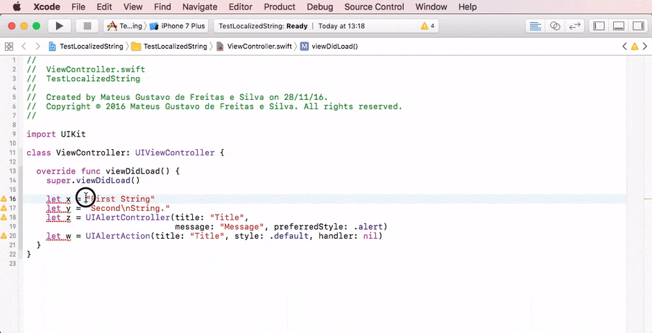
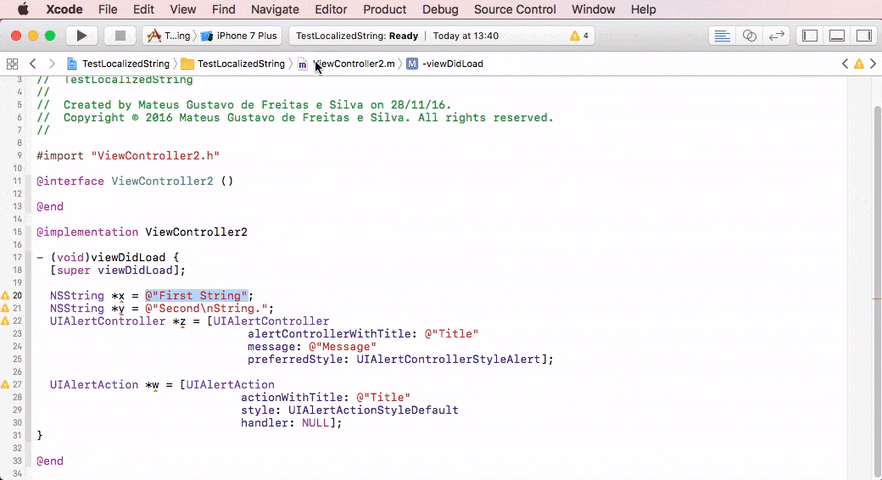
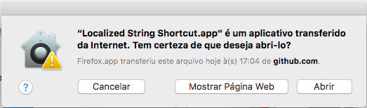
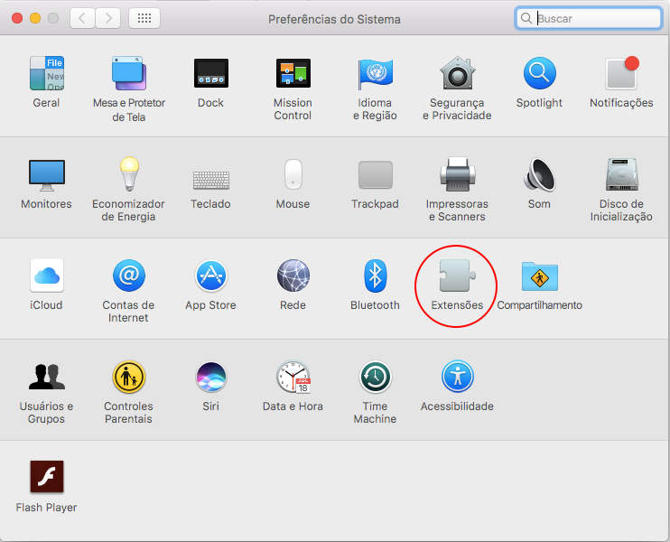
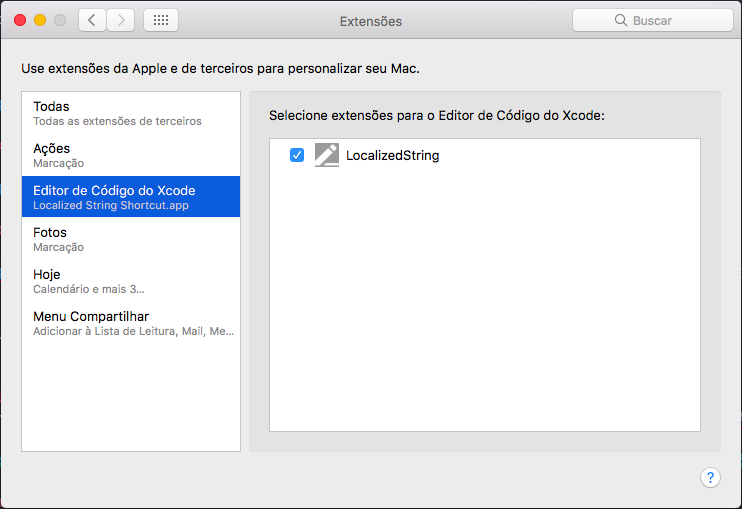
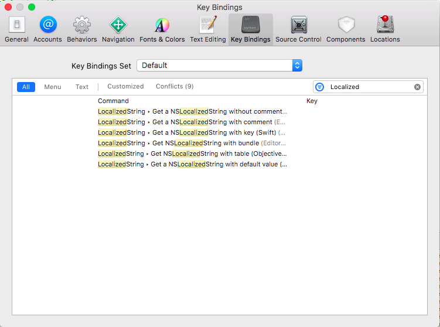

# LocalizedString

Xcode Source Editor Extension that helps to localize Swift and Objective-C source files

## Swift Example

## Objective-C Example

## Install on Xcode 8

1. Download the [Localized.String.Shortcut.app.zip📎](https://github.com/mateusfsilva/LocalizedString/releases/download/v1.0.0/Localized.String.Shortcut.app.zip)
2. Open and copy `Localized String Shortcut.app` to `/Applications` folder
3. Run it then close it.

   

## Usage without installing:

1. Install Xcode 8
2. Run Xcode 8 and install additional system components
3. Open this project in Xcode 8 and run the extension
4. Choose an app to run: Xcode 8
5. Select your code
6. Choose menu `Editor > LocalizedString`

## Usage

### 1. Enable LocalizedString
Check <kbd>System Preferences</kbd> -> <kbd>Extensions</kbd> -> <kbd>Xocde Source Editor</kbd> -> <kbd>LocalizedString</kbd>

   
   

### 2. Setting Shortcut in Xocde
<kbd>Preferences</kbd> -> <kbd>Key bindings</kbd> -> <kbd>Filter: Localized</kbd>

   

## Author

Mateus Freitas

[https://mateusfsilva.com](https://mateusfsilva.com)

License:
=================
The MIT License. See the LICENSE file for more infomation.
